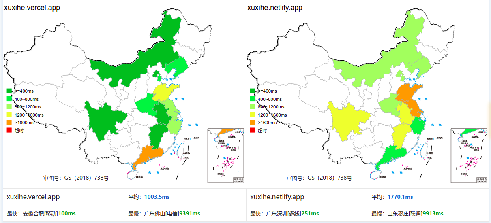
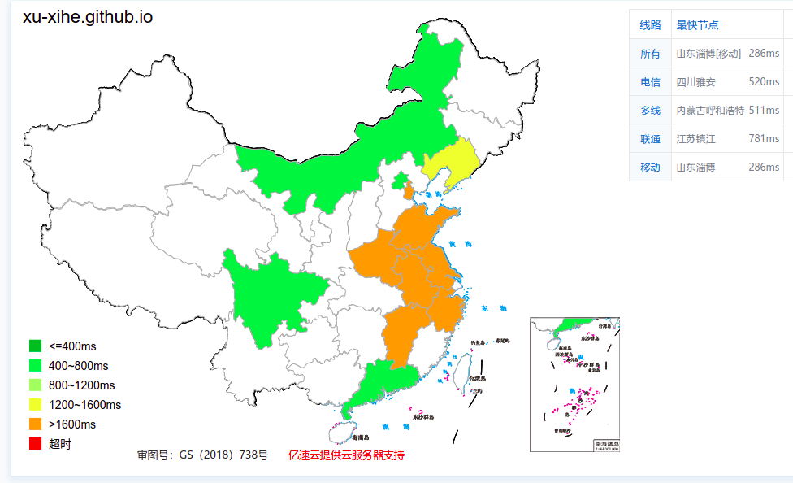

# Senie:欢迎
###### 本网站由Hugo驱动，并使用Docsy主题。

###### 采用GitHub Actions方式构建，并托管于GitHub Pages。

###### 构建源代码位于 `main` 分支，网页源码位于 `gh-pages` 分支。

### 访问地址：

###### 地址一：[Senie on Vercel](https://xuxihe.vercel.app/)

###### 地址二：[Senie on Netlify](https://xuxihe.netlify.app/)

###### 地址三：[Senie on Github](https://xu-xihe.github.io)

> 注：地址顺序与访问速度有关，但不绝对。以下仅供参考。
>
> 
> 

找到了几个好用的CDN，开心qwq。
